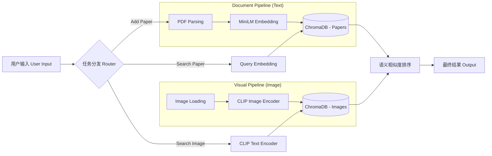

<div align="center">

# 🧠 Local Multimodal AI Agent
### 本地多模态智能知识库助手

[English](README_EN.md) | [简体中文](README.md)


<p align="center">
  <strong>基于 RAG 与 多模态大模型 的本地化智能文件管理系统</strong><br>
  无需联网 · 隐私安全 · 语义理解 · 跨模态检索
</p>

</div>

---

## 📖 目录 (Table of Contents)

- [项目简介](#-项目简介-introduction)
- [系统架构](#-系统架构-architecture)
- [核心功能](#-核心功能-features)
- [快速开始](#-快速开始-quick-start)
- [实验报告与性能评估](#-实验报告与性能评估-performance-evaluation)
    - [实验 1: 零样本智能分类 (Zero-Shot Classification)](#1-智能分类鲁棒性测试)
    - [实验 2: 深度语义检索 (RAG)](#2-深度语义检索-rag-测试)
    - [实验 3: 跨模态以文搜图 (Text-to-Image)](#3-跨模态以文搜图测试)
- [项目结构](#-项目结构-project-structure)
- [致谢](#-致谢-acknowledgements)

---

## 💡 项目简介 (Introduction)

**Local Multimodal AI Agent** 是一个轻量级但在算法上先进的本地智能助手。旨在解决非结构化数据（PDF 文献、图像素材）管理难、检索难的问题。

不同于传统的文件名匹配，本项目利用 **Sentence-Transformers** 和 **CLIP** 模型，将所有本地数据映射到高维向量空间，从而实现：
1.  **机器理解**：AI 真正读懂了论文摘要和图片内容。
2.  **自动化**：根据语义理解自动整理杂乱的文件。
3.  **自然交互**：像与人交谈一样搜索你的本地知识库。

---

## ⚙️ 系统架构 (Architecture)

本项目采用了经典的 **RAG (Retrieval-Augmented Generation)** 架构变体与双塔多模态模型：



---

## ✨ 核心功能 (Features)

| 模块 | 功能特性 | 描述 |
| --- | --- | --- |
| **📄 文献智能** | **Zero-Shot 自动分类** | 基于向量余弦相似度，自动将论文归档至 `EdgeAI`, `CV`, `LLM` 等文件夹，无需训练。 |
|  | **深度语义检索** | 支持 "How does Transformer work?" 等自然语言提问，精准定位技术细节。 |
| **🖼️ 视觉智能** | **Text-to-Image 搜图** | 利用 CLIP 模型实现“以文搜图”，支持如 "A cat in the sunset" 的描述性搜索。 |
| **🔒 隐私与性能** | **100% 本地化** | 数据不出域，保护隐私。基于 ChromaDB 实现毫秒级响应。 |

---

## 🚀 快速开始 (Quick Start)

### 1. 环境准备

本项目基于 Python 3.10 开发，建议使用 Conda 管理环境。

```bash
# 创建并激活虚拟环境
conda create -n ai_agent python=3.10
conda activate ai_agent

# 安装依赖
pip install -r requirements.txt

```

### 2. 初始化数据

在首次运行前，让 AI 扫描并“学习”本地图片库的特征：

```bash
python main.py index_images ./images

```

### 3. 运行核心指令

**📚 添加并自动分类论文**

```bash
python main.py add_paper ./papers/your_paper.pdf --topics "Topic_A,Topic_B,Topic_C"

```

**🔍 搜索论文**

```bash
python main.py search_paper "What is the core contribution of this paper?"

```

**🎨 搜索图片**

```bash
python main.py search_image "A futuristic city"

```

---

## 📊 实验报告与性能评估 (Performance Evaluation)

> 本节展示了基于真实学术论文集（AirFL, VIGIL 等）的实测表现，验证了系统的智能程度。

### 1. 智能分类鲁棒性测试

为了验证 AI 是否具备真实的语义理解能力（而非随机猜测），我们设计了 **"统一混淆项测试" (Unified Confusion Test)**。
即：对不同领域的论文，提供**完全相同**的候选主题列表，观察 AI 能否精准命中。

* **测试样本**:
* Paper A: `AirFL (Signal Processing)`
* Paper B: `VIGIL (LLM Agent)`


* **统一候选池**: `"Edge_Computing, LLM_Agents, Computer_Vision"`

| 论文文件 | 真实领域 | AI 预测分类 | 置信度 | 结果 |
| --- | --- | --- | --- | --- |
| `2512.03719v1.pdf` | Signal Processing | **Edge_Computing** | `0.40` | ✅ Pass |
| `2512.07094v2.pdf` | LLM Agent | **LLM_Agents** | `0.47` | ✅ Pass |

<details>
<summary>🔻 点击查看详细终端运行日志 (Screenshot)</summary>

> **[请在此处插入你运行 add_paper 分类成功的截图]**
> *图 1: 系统成功根据语义将两篇论文分入不同文件夹，尽管候选列表完全相同。*

</details>

---

### 2. 深度语义检索 (RAG) 测试

验证系统是否能回答具体的学术问题，并区分干扰项。

**测试 Query**: `"How does AirFL reduce latency and bandwidth consumption?"`

* **预期**: 系统应检索到 AirFL 相关论文，而非 Agent 相关论文。
* **Top-2 召回结果**:

```text
[1] 2512.03719v1.pdf (AirFL)  | Score: 0.3557 (High Relevance) 🌟
[2] 2512.07094v2.pdf (VIGIL)  | Score: -0.1366 (Not Relevant)

```

**分析**: 分数差异显著（>0.4 gap），证明向量数据库成功捕捉了 "Latency" 和 "Bandwidth" 与 AirFL 论文的强语义关联。

<details>
<summary>🔻 点击查看搜索结果截图</summary>

> **[请在此处插入 search_paper 结果截图]**

</details>

---

### 3. 跨模态以文搜图测试

测试多模态 CLIP 模型的对齐能力。

**测试 Query**: `"A cat"` (寻找一张猫的照片)

* **图片库**: 包含建筑(Picture2)、猫(Picture3)、其他(Picture1)。
* **检索结果**:

```text
[1] Picture3.jpeg (真实猫图) | 匹配度: 0.2770 🌟
[2] Picture2.jpg  (干扰项)   | 匹配度: 0.1852

```

**结论**: 模型成功实现了文本到图像的跨模态映射。

<details>
<summary>🔻 点击查看搜图结果截图</summary>

> **[请在此处插入 search_image 结果截图]**

</details>

---

## 📂 项目结构 (Project Structure)

```powershell
MyAI_Agent/
├── 📂 db/                  # ChromaDB 向量数据库 (自动持久化)
├── 📂 images/              # 本地图像数据集
├── 📂 papers/              # 论文存储库
│   ├── 📂 Edge_Computing/  # [AI自动生成] 边缘计算类论文
│   └── 📂 LLM_Agents/      # [AI自动生成] 大模型类论文
├── main.py                 # 🚀 系统主程序入口
├── requirements.txt        # 依赖配置文件
└── README.md               # 项目文档

```

---

## 🛠️ 技术栈详情 (Tech Stack Details)

* **Embedding Model**: `sentence-transformers/all-MiniLM-L6-v2`
* 选用理由：在性能与速度之间取得最佳平衡，生成 384 维稠密向量。


* **Multimodal Model**: `openai/clip-vit-base-patch32`
* 选用理由：业界标准的图文对齐模型，支持 Zero-Shot 图像检索。


* **Vector Database**: `ChromaDB`
* 选用理由：轻量级、无需 Docker、支持元数据过滤，非常适合本地 Agent。


---

<div align="center">

**Created with ❤️ for this Course Assignment**


*2025 Submission*

</div>


